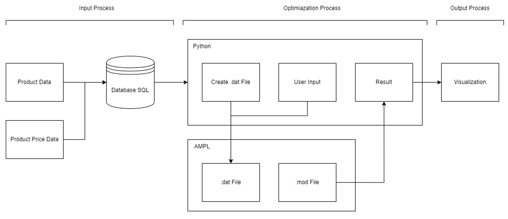
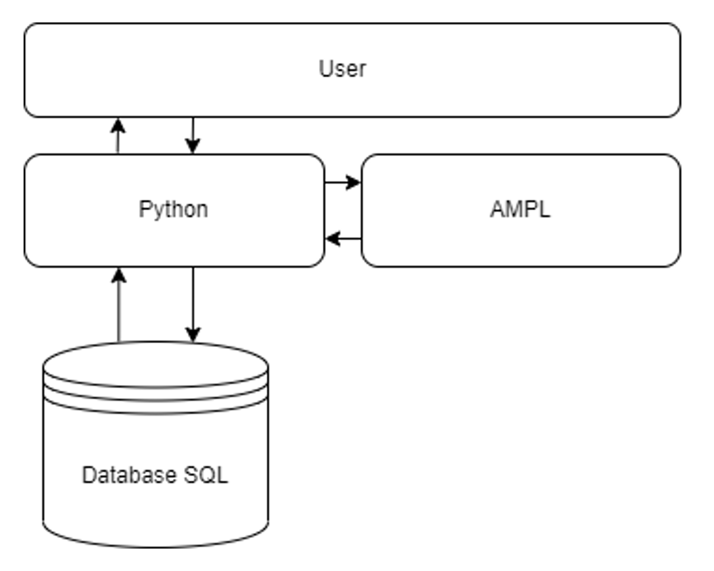
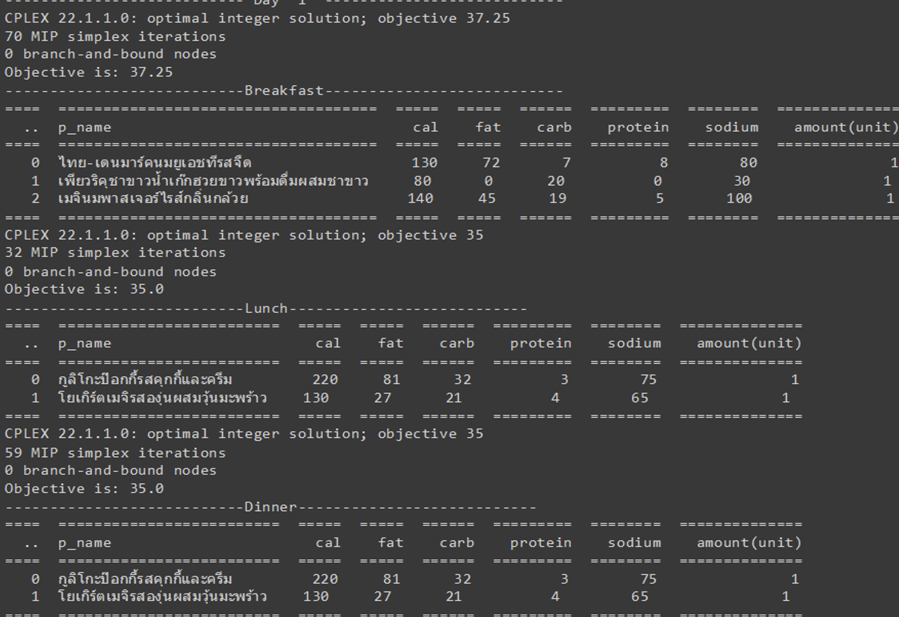
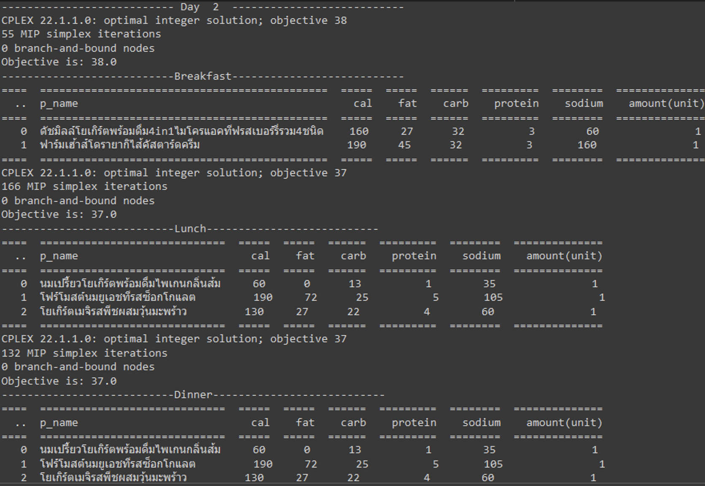

# 7-Eleven Meal Optimization

## Introduction
We know that 7-11 is one of the most famous convenience stores, with more than 13,000 branches in Thailand, each serving an average of over 900 people per day. 
When faced with the question, "What should we eat when coming to 7-11?", the answer is not simple due to the vast variety of tasty-looking products available.

Have you ever faced a situation where it's time to eat, but you are unable to decide what to eat? Your stomach is growling with hunger, but your brain is stuck on the question, 
"What should I eat?" In those moments, you wish someone or something could help you make the right choice because you have no idea what you really want to eat.

Therefore, the objective of this project is to solve this problem by recommending what customers should decide to eat, considering both cost and nutritional conditions. 
We will use an optimization model (simplex algorithm) to find optimal solutions, which will be sets of meals per day or per week (the optimal solution), depending on users' 
preferences, with minimum cost (the objective function).

## Project Overview
### Project Overview Diagram

In this project, we extracted data from fit-d.com and 7eleven.co.th due to their availability. These websites provide information about 7-Eleven products, 
including their costs and nutritional values. We have extracted and transformed this data into an SQL database.

After transforming the data into the database, we use Python to pull data from the SQLite database. We then receive user preferences about the required nutrients and the 
maximum cost per meal to set the constraints for the optimization model. We create a data file (.dat) as a template for using AMPL simplex to solve the optimization model.

Then, we create the optimization model using AMPL to find the sets of meals per day or per week (the optimal solution) based on user preferences, with minimum cost as the 
objective function. After obtaining the results, we send the results from AMPL back to Python for visualization and display the sequence of product sets to users.

The technology stack diagram is shown below.

### Input
The input for this project is separated into three categories as follows:
1. 7-Eleven product data, including extracted nutrients such as calories, fat, carbohydrates, and protein
2. 7-Eleven Product Price 
3. User preferences, including expected cost and expected values for each nutrient.

We categorize 7-Eleven food products as follows: frozen food, appetizers, beverages, milk, bakery items, snacks, ice cream, and instant food. We are interested only in the 
food products category. Other categories are not included.

### Output
After entering the necessary information as input, which includes age, gender, the number of days (1-7 days), and budget per meal, as shown below.

The program will find the optimal solution and determine the value of the objective function (minimum cost) by calculating the cost of each food item and matching the nutrition 
of each meal with the constraints. Then, the program will generate the solution, which includes the food items for each meal. In this scenario, we require a 7-day food menu 
consisting of three meals per day, so the program will generate 21 meals for this period. The example of results are shown as follows.
- The menu for first day

- The menu for second day

## Future Work
The result is not entirely comprehensive. The daily menus generated by the menu generator may not always be practical because users sometimes prefer less variety in their meals. 
Additionally, constraints may not effectively eliminate previously consumed menus, and user preferences provided as input may not be sufficient. More inputs, such as specific 
nutrient requirements, are needed to enhance the generator's performance.

To improve the generator's accuracy, several issues must be addressed. Constraints should be thoroughly reconsidered to better align with customer preferences. Adding more user 
preferences and constraints will enhance the accuracy of the menu generator.

The future work could leverage the logic developed in this project to create a comprehensive menu generator program. This program could extend beyond 7-Eleven products 
by utilizing data-driven computational logic to generate menus from various sources.

